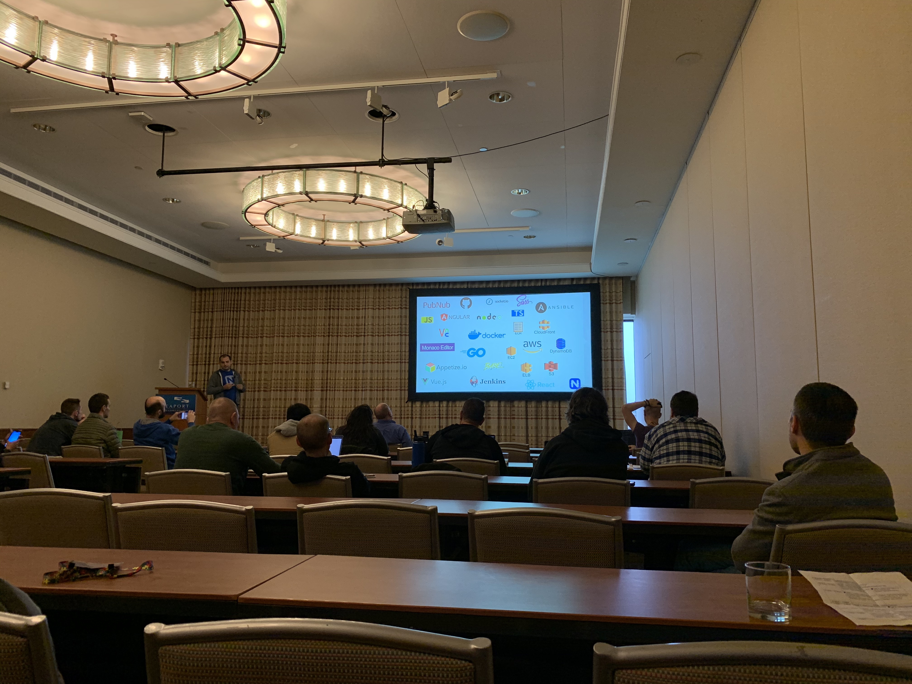

# NativeScript Playground: Behind the Scenes - Vasil Trifonov

> play.nativescript.org

### Playground Infrastructure

#### Backend

- Go backend
  - Running on AWS, two `t2.micro` instances
- PubNub for messaging (real-time publish/subscribe service)
- Deployment
  - Jenkins, Makefile, Docker and Ansible
- Two environments, UAT and Prod

#### Single Page Application (Playground Editor)

- Angular and Monaco Editor

#### Static Files

- Content is stored in Markdown
- Assets are stored on S3

#### Technologies Used:

#### interesting technical decisions

Original data was in db, but given the cost,  now saved the data in S3 and only save meta data in db. 
Only save the delta in S3 to save storage
Multi-region is expensive so not worth using it unless necessary
Started with JS and moved to GO to build the backend (no compelling reason) and happy with it. 
