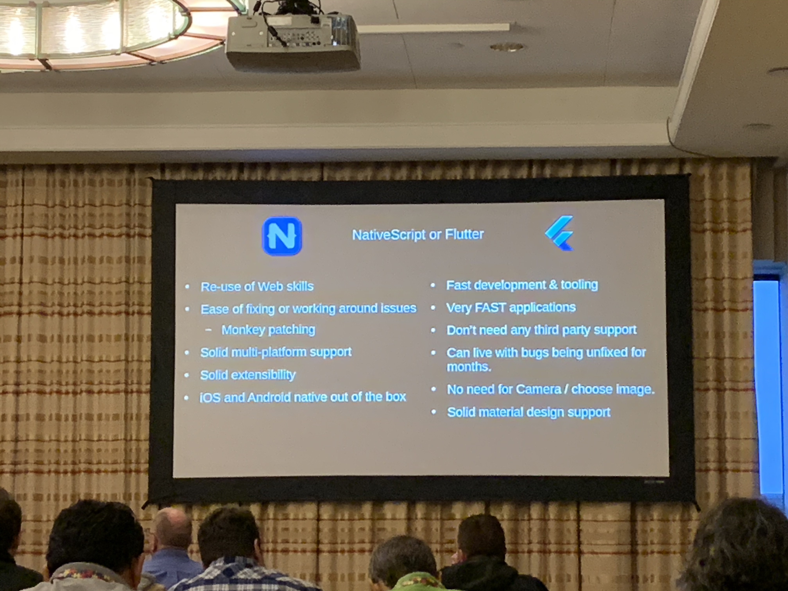

# Tale of Two Titans: Flutter and NativeScript - Nathanael Anderson

### NativeScript vs. Flutter

- NativeScript v0.9.0 released March 2015
  - Owned by Progress
  - 1k plugins in ecosystem
  - 17.8k ⭐️ on GitHub
- Flutter v1.0 released December 2018
  - Owned by Google
  - 4k plugins in ecosystem
  - 78k ⭐️ on GitHub
  - *Lots of Google funding!*

### Flutter + Dart

- #### Positives

  - Flutter written in **Dart** (transpiles to JS)
    - Dart was designed to be a replacement for the web
    - Dart is a modern, statically typed language from Google
  - Flutter is a compiled application, it is **not** shipped with source code embedded
    - As a result, it's very fast
    - **Much faster than NativeScript** (in some situations, order of magnitude faster)
  - ReactNative, NativeScript, etc. ships with source code (but it's often minified)
  - Flutter tooling is top-of-the-line (via Android Studio plugin)
    - Great code introspection
    - View hierarchy support
    - Performance monitoring and widget rebuilding

- #### Negatives

  - Flutter uses **no native components**, so does not gain access to neat Android/iOS features

    - Things like dark mode
    - All of Flutter's components have to be re-implemented by Google (even a text view - all custom code)

  - Similarly, the iOS and Android components are **completely separate**, so they behave very differently (following platform conventions for things like scrolling, table behavior, etc.)

    - In some places, for some components, you have to maintain duplicate code

  - There's no access to the native UI (because the **entire UI stack is rendered using OpenGL**)

  - Really weird bugs (showstopper category) that remain open **for months**

    - Serious crashing issues re: camera API

    - All of this is largely caused by Flutter's reimplementation of underlying components/APIs

      > "Flutter is great for apps thare aren't going to handle textual input"
      >
      > <pause for laughter/>

  

  ### NativeScript

  - #### Positives

    - Written using TypeScript, compiles to ES5/ES6
    - Has typings for **both native** platforms, which makes native coding very simple
    - Has some of the best new language support, since it's based on V8 or JSCore
    - You have access to `npm` packages!
    - **Full access, from JavaScript, to native platform classes and libraries**
      - ^ This is really the selling point of the entire library
    - One codebase, two platforms

  - #### Negatives

    - Smaller community
    - Slower startup time (running in V8)
    - No major commercial backing, aside from Progress
    - Sourcecode ships in your application
    - Sub-par tooling, compared to Flutter
    - PRs often sit open for months
    - Poor Kotlin/Swift support
    - Poor Canvas/OpenGL support

  - #### Flavors

    - NativeScript Core
      - Base system
    - NativeScript Angular
    - NativeScript Vue
      - Biggest differences between Core, Angular, and Vue is layout logic
    - NativeScript React
      - *Craig's commentary: Whaaaaaat*
    - ...and NS Svelte, NS Glimmer, xPlat

